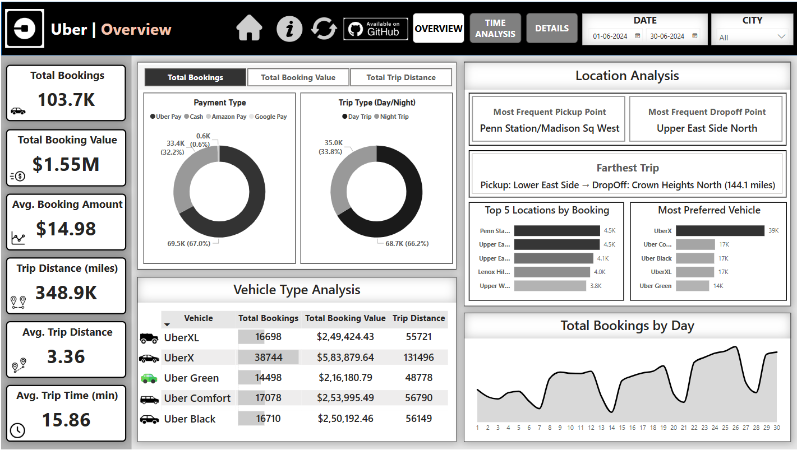

# Uber Trip Analysis Dashboard

An interactive Power BI dashboard to explore trip volume, revenue trends, and trip efficiency across various cities.

---

## Live Demo

[Click here to view the live dashboard](https://app.powerbi.com/view?r=eyJrIjoiYjEyNTAxNWQtMmEwOC00YjNhLTg2MTgtMjU2NGQxMjkwYzk1IiwidCI6ImE2MDRmOGE5LTE3ZjMtNGRiMy04Njk5LWFhZDQ1NjBiYzQ1YyJ9&pageName=7f5833854938eee274c5)

---

## Project Overview

This dashboard helps analyze Uber trip data over a selected time period. It tracks bookings, revenue, distances, and time metrics across cities, and enables users to explore how these trends vary across different times and locations.

### Expected Outcomes

* Identify trends in ride bookings and revenue generation.
* Analyze trip efficiency in terms of distance and duration.
* Compare booking values and trip patterns across different time periods.
* Provide insights to optimize pricing models and improve customer satisfaction.

---

## KPIs

1. Total Bookings – How many trips were booked over a given period?
2. Total Booking Value – What is the total revenue generated from all bookings?
3. Average Booking Value – What is the average revenue per booking?
4. Total Trip Distance – What is the total distance covered by all trips?
5. Average Trip Distance – How far are customers traveling on average per trip?
6. Average Trip Time – What is the average duration of trips?

---

## Dashboards Included

1. Overview
2. Time Analysis
3. Details

---

## Slicers Used

* Global Measure Selector: Switches between Total Bookings, Total Booking Value, and Trip Distance KPIs.
* Date Slicer: Selects the range of dates for data analysis.
* City Selector: Filters data for a specific city or shows all cities combined.

---

## Charts and Visuals Used

* Cards: Show all KPIs, most frequent pickup/dropoff points, farthest trip made.
* Donut Charts: Payment type, Trip type (day/night).
* Horizontal Bar Charts: Top five bookings by location, most preferred vehicle.
* Tables: Vehicle type analysis, Full trip details.
* Area Charts: Total bookings by day, KPI (based on measure selector) by Pickup Time and Day of Week.
* Matrix (Heatmap style): Total bookings by Hour and Day.

---

## Additional Features

* Page Navigator: Switch between dashboards.
* Dataset Information Button: Displays dataset details.
* Reset Dashboard: Clears all applied filters.
* Drill Through Feature: Right-clicking any point allows drilling into the details page, showing detailed trip data like Trip ID, Pickup Date & Time, Vehicle, Payment Mode, Distance, Fare, and Locations.

---

## Dataset Details

### Table 1: Trip Details

This table includes detailed information on individual Uber trips. It is used to analyze ride trends, peak hours, and revenue.

* Trip ID: Unique identifier for each trip.
* Pickup Time: When the trip started.
* Drop Off Time: When the trip ended.
* Passenger Count: Number of passengers.
* Trip Distance: Distance covered in miles.
* PULocationID: ID for pickup location (linked to Location Table).
* DOLocationID: ID for drop-off location (linked to Location Table).
* Payment Type: Mode of payment (e.g. credit card, wallet).
* Fare Amount: Base fare before any additional fees.
* Surge Fee: Extra charge during high-demand.
* Vehicle: Uber service type (e.g. UberX, Uber Black).

### Table 2: Location Table

This table maps each Location ID to its corresponding name and city, helping analyze geographic trends.

* LocationID: Unique identifier for each area.
* Location: Name of the neighborhood or area.

---

## Tools & Technologies Used

* Power BI Desktop
* DAX (Data Analysis Expressions)
* Power Query
* Interactive Visuals & Bookmarks
* Drill-through & Page Navigation
  
---

## Folder Structure
Uber Analysis Power BI Dashboard/
├── README.md # Project overview and documentation
├── UBER_ANALYSIS.pbix # Power BI dashboard file
├── datasets/ # Raw data used in the dashboard
│ ├── Location Table.xlsx
│ └── Uber Trip Details.xlsx
├── screenshots/ # Dashboard preview images
│ ├── overview.png
│ ├── time_analysis.png
│ └── details.png

---

## Contact

For questions or collaboration:

* Aryan Suresh
* aryan180702@gmail.com
* [Linkedin](https://www.linkedin.com/in/aryansuresh/)

